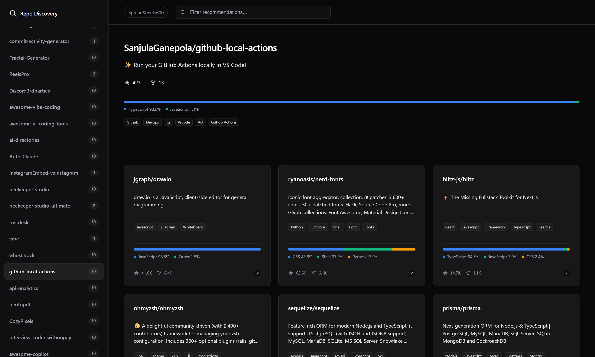

# Repo Recommendations

Generate GitHub repository recommendations based on your starred repositories and co-stargazers. The tool analyzes your GitHub stars and identifies other repositories that users who starred the same projects also found interesting. Results are saved as JSON files in the `data/recommendations/` directory.

## Screenshots

|              |
| -------------------------------------------------- |
| Preview of the pusblished site of recomened repos  |

## Configuration

All configuration is managed through `config/settings.yml`. You can override any setting with environment variables.

### Settings Overview

#### ClickHouse Configuration

- `clickhouse.url`: Database URL (default: `https://play.clickhouse.com`)
- `clickhouse.table`: Table containing GitHub events (default: `github_events`)
- `clickhouse.timeout`: Request timeout in seconds (default: `60`)

#### Processing Limits

- `processing.recent_repos_limit`: Maximum number of starred repositories to analyze (set `null` for no limit, default: `null`)
- `processing.max_workers`: Number of parallel workers for processing (default: `4`)
- `processing.top_n`: Maximum recommendations per repository (default: `10`)

#### Paths

- `paths.recommendations_dir`: Directory for storing recommendation files (default: `data/recommendations`)
- `paths.latest_json`: Path to the latest recommendations file (default: `data/recommendations/latest.json`)

#### User

- `user.login`: GitHub username to analyze

## Usage

Run the application with:

```bash
python main.py
```

The script will:

1. Fetch your starred repositories
2. Find repositories that share stargazers with your starred repos
3. Generate recommendations based on co-stargazing patterns
4. Save results to `data/recommendations/latest.json`
5. Render a static `index.html` using the Jinja template in `templates/index.html`

## Recommendation Data Fields

The output is grouped per starred (source) repository and contains:

### Source Repository

- **repo** - Repository name (`owner/repo`)
- **metadata**

  - **description** - Repository description
  - **languages** - Language usage breakdown
  - **topics** - GitHub topics

- **total_stars** - Total GitHub stars
- **total_forks** - Total GitHub forks

### Recommended Repositories

For each recommended repository:

- **repo** - Repository name (`owner/repo`)
- **count** - Number of overlapping stargazers
- **metadata**

  - **description** - Repository description
  - **languages** - Language usage breakdown
  - **topics** - GitHub topics

- **total_stars** - Total GitHub stars
- **total_forks** - Total GitHub forks
- **score** - Overlap ratio (`count / total_stars`, 0 if no stars)

<details>
<summary>Raw Json Data</summary>

```json
{
    "generated_at": "2026-01-19T05:41:26.596011+00:00",
    "username": "SpreadSheets600",
    "results": [
        {
            "repo": "ClickHouse/ClickHouse",
            "recommendations": [
                {
                    "repo": "apache/spark",
                    "count": 646,
                    "metadata": {
                        "description": "Apache Spark - A unified analytics engine for large-scale data processing",
                        "topics": [
                            "python",
                            "java",
                            "r",
                            "scala",
                            "sql",
                            "big-data",
                            "spark",
                            "jdbc"
                        ],
                        "languages": {
                            "Scala": "67.1%",
                            "Python": "16.8%",
                            "Java": "6.5%",
                            "Jupyter Notebook": "4.9%",
                            "HiveQL": "2.1%",
                            "R": "1.4%",
                            "Other": "1.2%"
                        }
                    },
                    "total_stars": 48802,
                    "total_forks": 37386,
                    "score": 0.013237
                },
                {
                    "repo": "apache/flink",
                    "count": 640,
                    "metadata": {
                        "description": "Apache Flink",
                        "topics": [
                            "python",
                            "java",
                            "scala",
                            "sql",
                            "big-data",
                            "flink"
                        ],
                        "languages": {
                            "Java": "87.3%",
                            "Scala": "8.3%",
                            "Python": "2.8%",
                            "Shell": "0.5%",
                            "TypeScript": "0.3%",
                            "HiveQL": "0.3%",
                            "Other": "0.5%"
                        }
                    },
                    "total_stars": 27512,
                    "total_forks": 16656,
                    "score": 0.023263
                },
                {
                    "repo": "kubernetes/kubernetes",
                    "count": 523,
                    "metadata": {
                        "description": "Production-Grade Container Scheduling and Management",
                        "topics": [
                            "go",
                            "kubernetes",
                            "containers",
                            "cncf"
                        ],
                        "languages": {
                            "Go": "97.4%",
                            "Shell": "2.3%",
                            "PowerShell": "0.2%",
                            "Makefile": "0.1%",
                            "Dockerfile": "0.0%",
                            "Python": "0.0%"
                        }
                    },
                    "total_stars": 119934,
                    "total_forks": 49424,
                    "score": 0.004361
                },
                {
                    "repo": "elastic/elasticsearch",
                    "count": 468,
                    "metadata": {
                        "description": "Free and Open Source, Distributed, RESTful Search Engine",
                        "topics": [
                            "java",
                            "search-engine",
                            "elasticsearch"
                        ],
                        "languages": {
                            "Java": "99.5%",
                            "Groovy": "0.2%",
                            "StringTemplate": "0.2%",
                            "Shell": "0.1%",
                            "ANTLR": "0.0%",
                            "C++": "0.0%"
                        }
                    },
                    "total_stars": 74985,
                    "total_forks": 30967,
                    "score": 0.006241
                },
                {
                    "repo": "pingcap/tidb",
                    "count": 462,
                    "metadata": {
                        "description": "TiDB - the open-source, cloud-native, distributed SQL database designed for modern applications.",
                        "topics": [
                            "mysql",
                            "go",
                            "sql",
                            "database",
                            "scale",
                            "serverless",
                            "distributed-transactions",
                            "distributed-database",
                            "cloud-native",
                            "tidb",
                            "hacktoberfest",
                            "htap",
                            "mysql-compatibility"
                        ],
                        "languages": {
                            "Go": "94.2%",
                            "Starlark": "3.0%",
                            "Shell": "1.6%",
                            "Yacc": "0.8%",
                            "Jsonnet": "0.2%",
                            "TypeScript": "0.1%",
                            "Other": "0.1%"
                        }
                    },
                    "total_stars": 43052,
                    "total_forks": 7686,
                    "score": 0.010731
                },
                {
                    "repo": "tensorflow/tensorflow",
                    "count": 445,
                    "metadata": {
                        "description": "An Open Source Machine Learning Framework for Everyone",
                        "topics": [
                            "python",
                            "machine-learning",
                            "deep-neural-networks",
                            "deep-learning",
                            "neural-network",
                            "tensorflow",
                            "ml",
                            "distributed"
                        ],
                        "languages": {
                            "C++": "55.7%",
                            "Python": "25.5%",
                            "MLIR": "6.3%",
                            "HTML": "4.2%",
                            "Starlark": "4.1%",
                            "Go": "1.2%",
                            "Other": "3.0%"
                        }
                    },
                    "total_stars": 228592,
                    "total_forks": 114876,
                    "score": 0.001947
                },
                {
                    "repo": "apache/kafka",
                    "count": 442,
                    "metadata": {
                        "description": "Mirror of Apache Kafka",
                        "topics": [
                            "scala",
                            "kafka"
                        ],
                        "languages": {
                            "Java": "87.2%",
                            "Scala": "10.6%",
                            "Python": "1.9%",
                            "Shell": "0.2%",
                            "Batchfile": "0.1%",
                            "Dockerfile": "0.0%"
                        }
                    },
                    "total_stars": 33929,
                    "total_forks": 17900,
                    "score": 0.013027
                },
                {
                    "repo": "facebook/rocksdb",
                    "count": 420,
                    "metadata": {
                        "description": "A library that provides an embeddable, persistent key-value store for fast storage.",
                        "topics": [
                            "database",
                            "storage-engine"
                        ],
                        "languages": {
                            "C++": "83.2%",
                            "Java": "8.8%",
                            "Starlark": "2.2%",
                            "C": "1.7%",
                            "Python": "1.4%",
                            "Perl": "0.8%",
                            "Other": "1.9%"
                        }
                    },
                    "total_stars": 33088,
                    "total_forks": 7862,
                    "score": 0.012693
                },
                {
                    "repo": "torvalds/linux",
                    "count": 393,
                    "metadata": {
                        "description": "Linux kernel source tree",
                        "topics": [],
                        "languages": {
                            "C": "98.0%",
                            "Assembly": "0.7%",
                            "Shell": "0.4%",
                            "Rust": "0.3%",
                            "Python": "0.3%",
                            "Makefile": "0.2%",
                            "Other": "0.1%"
                        }
                    },
                    "total_stars": 239118,
                    "total_forks": 79165,
                    "score": 0.001644
                },
                {
                    "repo": "golang/go",
                    "count": 363,
                    "metadata": {
                        "description": "The Go programming language",
                        "topics": [
                            "go",
                            "language",
                            "programming-language",
                            "golang"
                        ],
                        "languages": {
                            "Go": "89.7%",
                            "Assembly": "5.4%",
                            "HTML": "4.5%",
                            "C": "0.2%",
                            "Shell": "0.1%",
                            "Perl": "0.1%"
                        }
                    },
                    "total_stars": 152724,
                    "total_forks": 26080,
                    "score": 0.002377
                }
            ],
            "metadata": {
                "description": "ClickHouse\u00ae is a real-time analytics database management system",
                "topics": [
                    "rust",
                    "embedded",
                    "sql",
                    "database",
                    "big-data",
                    "ai",
                    "analytics",
                    "cpp",
                    "clickhouse",
                    "dbms",
                    "self-hosted",
                    "distributed",
                    "olap",
                    "cloud-native",
                    "mpp",
                    "hacktoberfest",
                    "lakehouse"
                ],
                "languages": {
                    "C++": "71.8%",
                    "Python": "9.2%",
                    "Assembly": "8.9%",
                    "Shell": "4.1%",
                    "C": "2.2%",
                    "Jinja": "1.6%",
                    "Other": "2.2%"
                }
            },
            "total_stars": 36888,
            "total_forks": 7581
        }
    ]
}

```

</details>

## Automation

- Last recommendations run: <!-- RECO_TS_START -->2026-04-05 02:07:09 UTC<!-- RECO_TS_END -->
- Latest recommendations file: <!-- RECO_FILE_START -->[recommendations/latest.json](recommendations/latest.json)<!-- RECO_FILE_END -->
